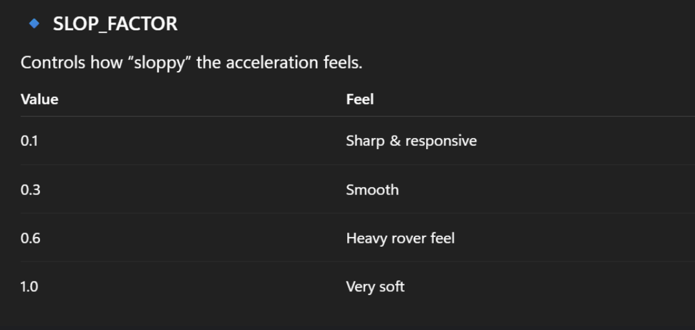

## Arduino Mega Libraries

| Library | Purpose | Install via |
|---|---|---|
| `IBusBM` | FlySky iBUS RC receiver decoding (Serial1) | Arduino Library Manager |
| `Adafruit_PWMServoDriver` | PCA9685 servo driver (I2C master) | Arduino Library Manager |
| `Wire` | I2C bus — used by PCA9685 only | Built-in (Arduino AVR core) |

## Pi ↔ Mega Communication

The Mega sends a 9-byte framed status frame to the Raspberry Pi at **10 Hz** over
**USB Serial** (`Serial` / `/dev/ttyACM0`, 115200 baud).

No level shifter required. Just the USB cable used to flash the Mega.

Frame format: `[0xAA, 0x55, tool_water, tool_air, tool_soil, ibus_pulse, movement, pump_running, failsafe]`

The Pi reads this via `sensor/mega.py` (pyserial). See `scratch/README_serial_test.md`
for the full test procedure.

## FlySky Controller Channel Map

| Stick / Switch | Channel | Index | Function |
|---|---|---|---|
| Right stick ← → | CH1 | 0 | Steering / Turn |
| Right stick ↑ ↓ | CH2 | 1 | Forward / Reverse |
| Left stick ↑ ↓  | CH3 | 2 | Throttle (speed scale); iBUS validity check |
| Switch A | CH5 | 4 | Soil tool — servo + H-bridge actuator |
| Switch B | CH6 | 5 | Water tool — servo + H-bridge actuator + pump |
| Switch C | CH7 | 6 | Air tool — servo + flag to Pi |

